# A2A Protocol Implementation and Request Flows

## 📋 Table of Contents

1. [A2A Protocol Overview](#a2a-protocol-overview)
2. [Agent Registration and Discovery](#agent-registration-and-discovery)
3. [Message Format and Communication](#message-format-and-communication)
4. [Request Flow Patterns](#request-flow-patterns)
5. [Agent Capability Declarations](#agent-capability-declarations)
6. [Error Handling in A2A Communication](#error-handling-in-a2a-communication)
7. [Performance and Monitoring](#performance-and-monitoring)

---

## 🌐 A2A Protocol Overview

The Sasya Chikitsa multi-agent system implements the Agent-to-Agent (A2A) protocol using the [python-a2a](https://python-a2a.readthedocs.io/) library, which provides a production-ready implementation of Google's Agent-to-Agent communication standard.

### Key Components

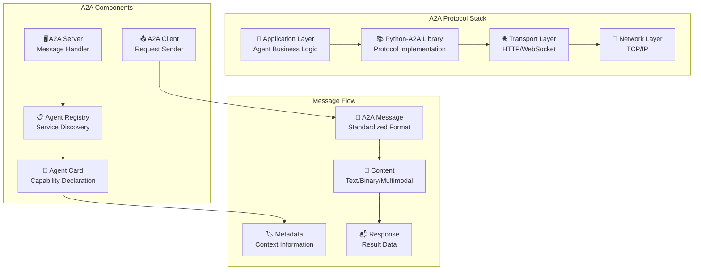

### Protocol Benefits

- **Standardization**: Follows Google's A2A specification
- **Interoperability**: Compatible with other A2A-compliant systems
- **Scalability**: Built for distributed agent architectures
- **Reliability**: Built-in error handling and retry mechanisms
- **Discovery**: Automatic agent registration and capability discovery
- **Security**: Authentication and authorization support
- **Monitoring**: Built-in metrics and health checking

---

## 🔍 Agent Registration and Discovery

### Agent Registration Process

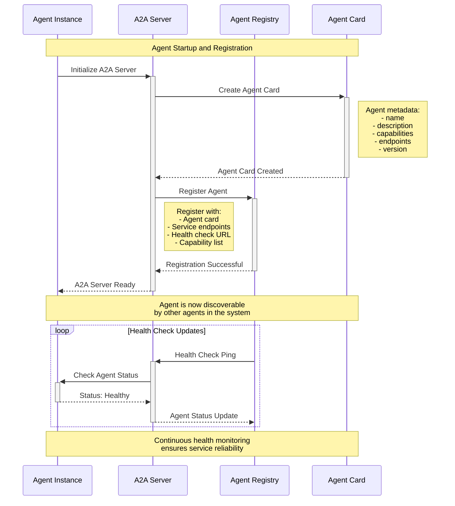

### Agent Discovery Flow

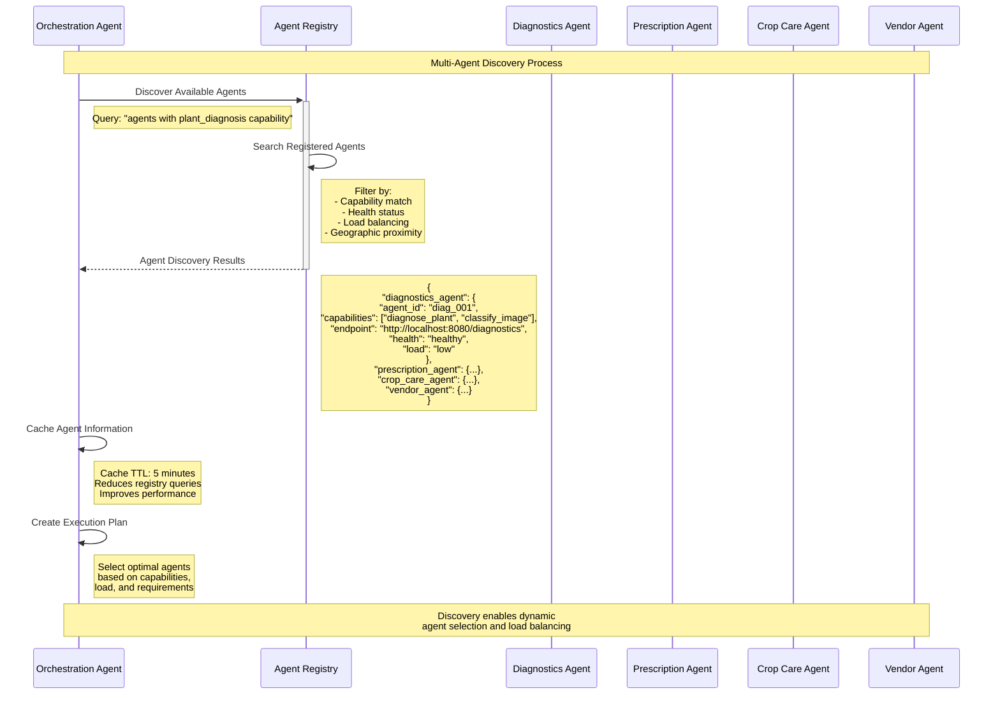

### Agent Card Declaration

```python
# Example Agent Card for Diagnostics Agent
agent_card = AgentCard(
    name="Multimodal Diagnostics Agent",
    description="Advanced plant disease diagnosis using CNN and multimodal analysis",
    url="http://localhost:8080/agents/diagnostics",
    version="2.1.0",
    provider="sasya-chikitsa",
    documentation_url="https://sasya-chikitsa.com/docs/diagnostics-agent",
    authentication=None,
    capabilities={
        "primary_functions": [
            "diagnose_plant",
            "classify_image", 
            "analyze_text_symptoms",
            "process_video",
            "synthesize_multimodal_results"
        ],
        "supported_media_types": ["image/jpeg", "image/png", "video/mp4", "text/plain"],
        "supported_plant_types": ["tomato", "potato", "pepper", "eggplant", "cucumber"],
        "supported_diseases": [
            "early_blight", "late_blight", "bacterial_spot", 
            "mosaic_virus", "leaf_curl", "powdery_mildew"
        ],
        "response_time": "2-5 seconds",
        "confidence_threshold": 0.7,
        "attention_visualization": True,
        "batch_processing": False,
        "max_concurrent_requests": 10
    },
    metadata={
        "model_version": "cnn_attention_v2.1", 
        "training_data": "plant_disease_dataset_2024",
        "accuracy": 0.92,
        "supported_languages": ["en", "hi", "mr"],
        "deployment_region": "asia-south1",
        "resource_requirements": {
            "cpu": "2 cores",
            "memory": "4GB", 
            "gpu": "optional"
        }
    }
)
```

---

## 📨 Message Format and Communication

### A2A Message Structure

```python
# A2A Message Components
class A2AMessage:
    """Standard A2A message format"""
    
    # Message Content
    content: Union[TextContent, BinaryContent, MultimodalContent]
    
    # Message Metadata  
    role: MessageRole  # AGENT, USER, SYSTEM
    conversation_id: str  # Session identifier
    message_id: str  # Unique message ID
    
    # A2A Protocol Fields
    source_agent: str  # Sending agent ID
    target_agent: str  # Receiving agent ID
    operation: str  # Requested operation
    priority: int  # Message priority (1-10)
    
    # Context and State
    context: Dict[str, Any]  # Request context
    state: Dict[str, Any]  # Conversation state
    metadata: Dict[str, Any]  # Additional metadata
    
    # Timestamps
    created_at: datetime
    expires_at: Optional[datetime]
    
    # Error Handling
    retry_count: int = 0
    max_retries: int = 3
```

### Message Flow Example

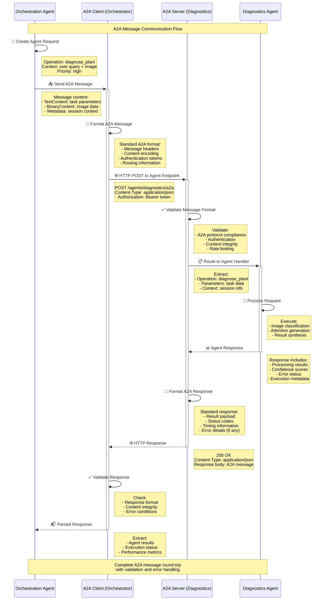

### Content Types and Encoding

```python
# A2A Content Types
from python_a2a.models.content import TextContent, BinaryContent, MultimodalContent

# Text Content (JSON parameters)
text_content = TextContent(
    text=json.dumps({
        "operation": "diagnose_plant",
        "user_query": "What disease is this?",
        "context": {
            "location": "Maharashtra, India",
            "season": "monsoon",
            "plant_type": "tomato"
        }
    })
)

# Binary Content (Image data)
binary_content = BinaryContent(
    data=base64.b64decode(image_base64),
    mime_type="image/jpeg",
    filename="plant_image.jpg"
)

# Multimodal Content (Combined data)
multimodal_content = MultimodalContent(
    parts=[
        {"type": "text", "content": task_parameters},
        {"type": "image", "content": image_data, "mime_type": "image/jpeg"},
        {"type": "metadata", "content": context_data}
    ]
)

# A2A Message Construction
message = Message(
    content=multimodal_content,
    role=MessageRole.AGENT,
    conversation_id=session_id,
    metadata={
        "source_agent": "orchestrator",
        "target_agent": "diagnostics",
        "operation": "diagnose_plant",
        "priority": 8,
        "timeout": 60,
        "retry_policy": "exponential_backoff"
    }
)
```

---

## 🔄 Request Flow Patterns

### Pattern 1: Simple Agent-to-Agent Request

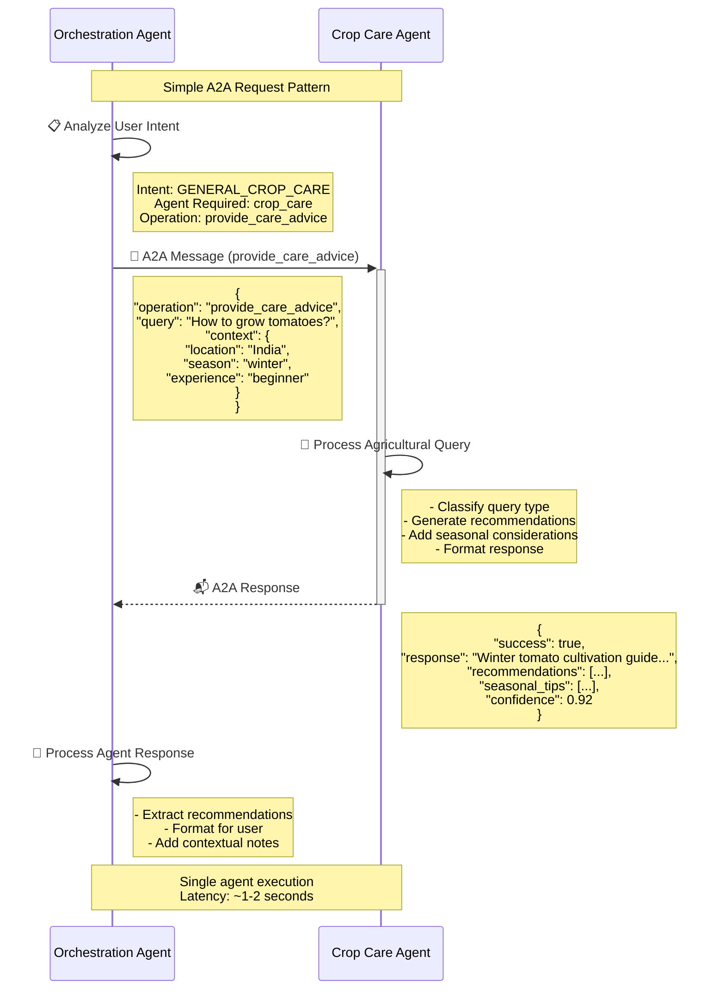

### Pattern 2: Sequential Multi-Agent Workflow

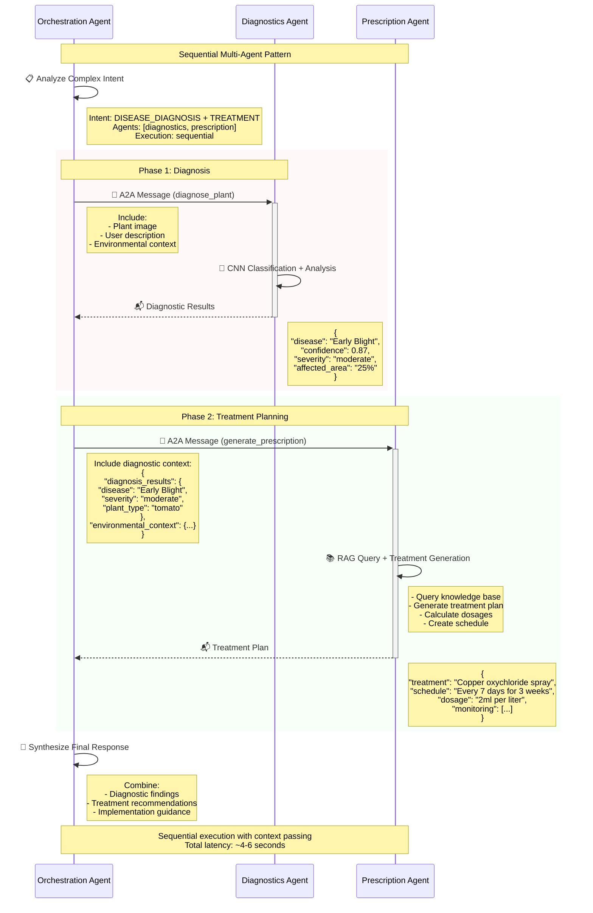

### Pattern 3: Parallel Multi-Agent Execution

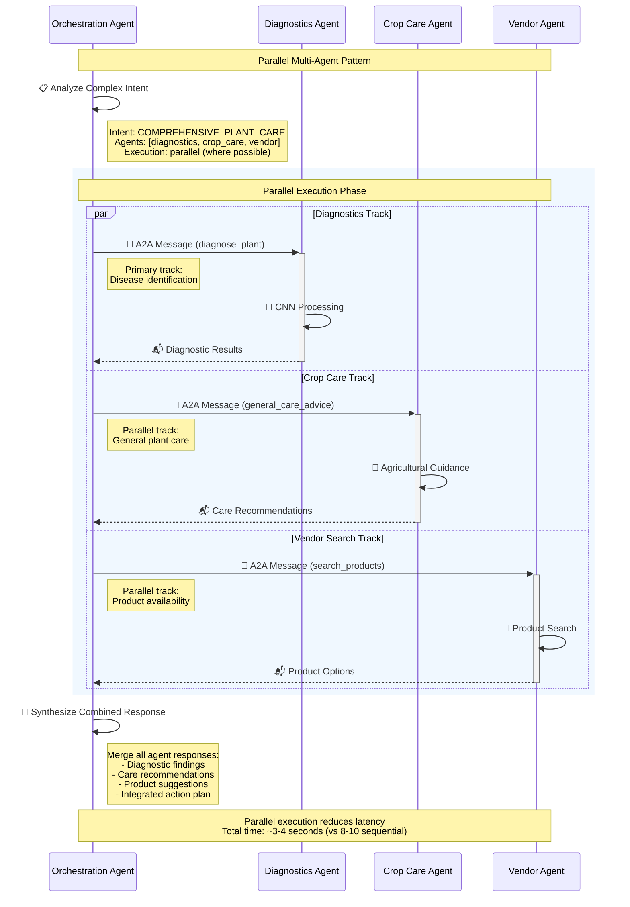

### Pattern 4: Conditional Agent Routing

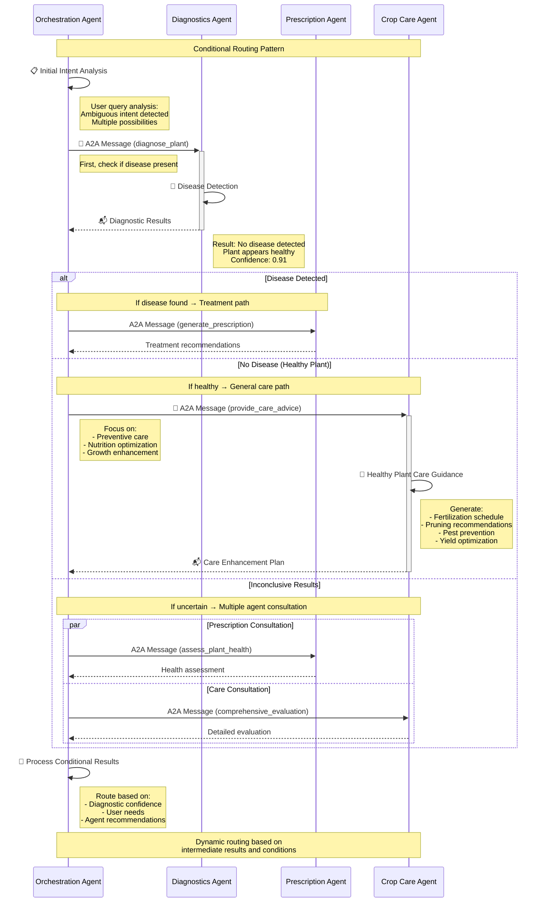

---

## 🎯 Agent Capability Declarations

### Capability Registration System

```python
class AgentCapabilityManager:
    """Manage and declare agent capabilities for A2A discovery"""
    
    def __init__(self, agent_type: AgentType):
        self.agent_type = agent_type
        self.capabilities = self._initialize_capabilities()
        
    def _initialize_capabilities(self) -> Dict[str, Any]:
        """Initialize agent-specific capabilities"""
        
        if self.agent_type == AgentType.DIAGNOSTICS:
            return {
                "primary_operations": [
                    {
                        "name": "diagnose_plant",
                        "description": "Comprehensive plant disease diagnosis",
                        "input_types": ["image", "text", "video"],
                        "output_format": "structured_diagnosis",
                        "average_latency": "3-5 seconds",
                        "confidence_threshold": 0.7,
                        "supported_formats": ["jpeg", "png", "mp4"]
                    },
                    {
                        "name": "classify_image", 
                        "description": "Image-only disease classification",
                        "input_types": ["image"],
                        "output_format": "classification_result",
                        "average_latency": "2-3 seconds",
                        "batch_support": True,
                        "max_batch_size": 5
                    }
                ],
                "specialized_features": {
                    "attention_visualization": {
                        "enabled": True,
                        "color_schemes": ["blue_yellow", "red_yellow", "grayscale"],
                        "overlay_formats": ["base64_png", "coordinates"],
                        "clickable_regions": True
                    },
                    "multimodal_fusion": {
                        "image_text_combination": True,
                        "video_frame_analysis": True,
                        "temporal_analysis": False
                    }
                },
                "supported_plant_types": [
                    "tomato", "potato", "pepper", "eggplant", "cucumber",
                    "cabbage", "cauliflower", "lettuce", "spinach"
                ],
                "disease_categories": [
                    "fungal", "bacterial", "viral", "nutritional", "pest_damage"
                ],
                "performance_metrics": {
                    "accuracy": 0.92,
                    "precision": 0.89,
                    "recall": 0.94,
                    "f1_score": 0.91
                }
            }
            
        elif self.agent_type == AgentType.PRESCRIPTION:
            return {
                "primary_operations": [
                    {
                        "name": "generate_prescription",
                        "description": "Create tailored treatment plans",
                        "input_requirements": ["disease_diagnosis", "plant_context"],
                        "output_format": "structured_prescription",
                        "customization_level": "high",
                        "average_latency": "1-3 seconds"
                    },
                    {
                        "name": "query_rag_knowledge",
                        "description": "Query treatment knowledge base",
                        "knowledge_domains": ["treatments", "products", "schedules"],
                        "search_methods": ["semantic", "keyword", "similarity"],
                        "response_format": "ranked_results"
                    }
                ],
                "knowledge_base": {
                    "treatment_database": {
                        "size": "50,000+ treatments",
                        "coverage": "comprehensive",
                        "update_frequency": "monthly",
                        "languages": ["english", "hindi"]
                    },
                    "product_database": {
                        "organic_treatments": 1200,
                        "chemical_treatments": 800,
                        "biological_controls": 400,
                        "local_availability": True
                    }
                },
                "customization_factors": [
                    "disease_severity",
                    "plant_growth_stage", 
                    "environmental_conditions",
                    "farmer_preferences",
                    "budget_constraints",
                    "organic_vs_chemical"
                ]
            }
            
        # Similar capability definitions for other agents...
        
    def get_capability_declaration(self) -> Dict[str, Any]:
        """Get formatted capability declaration for A2A registration"""
        return {
            "agent_type": self.agent_type.value,
            "capabilities": self.capabilities,
            "service_level": {
                "availability": "99.5%",
                "max_concurrent_requests": 10,
                "rate_limiting": "100 requests/minute",
                "timeout_policy": "60 seconds"
            },
            "integration": {
                "a2a_protocol_version": "1.0",
                "message_formats": ["json", "binary", "multimodal"],
                "authentication_methods": ["bearer_token", "api_key"],
                "health_check_endpoint": "/health"
            }
        }
```

### Dynamic Capability Updates

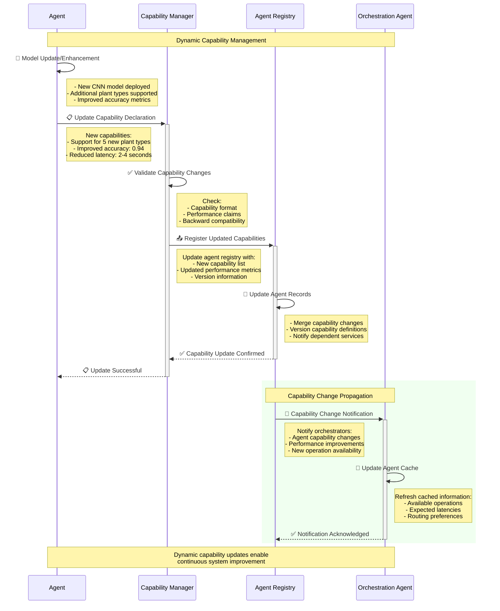

---

## ⚠️ Error Handling in A2A Communication

### A2A Error Categories

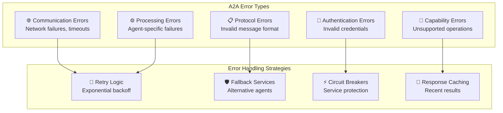

### Error Recovery Flow

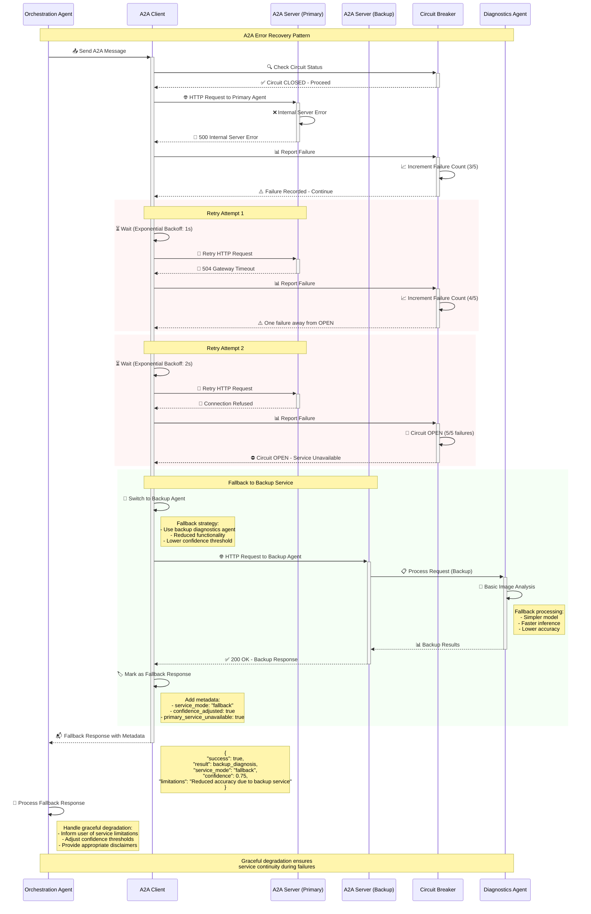

### Error Response Formats

```python
# A2A Error Response Format
class A2AErrorResponse(BaseModel):
    """Standardized A2A error response"""
    
    error: bool = True
    error_code: str  # Standard error codes
    error_message: str  # Human-readable message
    error_details: Dict[str, Any]  # Detailed error information
    
    # A2A Protocol Fields
    message_id: str  # Reference to original message
    conversation_id: str  # Session identifier
    agent_id: str  # Error-producing agent
    
    # Recovery Information
    retry_after: Optional[int] = None  # Seconds before retry
    alternative_agents: List[str] = []  # Fallback options
    fallback_available: bool = False
    
    # Debugging Information
    stack_trace: Optional[str] = None
    request_context: Dict[str, Any] = {}
    performance_metrics: Dict[str, float] = {}
    
    # Timestamps
    error_timestamp: datetime = Field(default_factory=datetime.now)
    request_timestamp: Optional[datetime] = None
    
# Example Error Responses
image_processing_error = A2AErrorResponse(
    error_code="IMAGE_PROCESSING_FAILED",
    error_message="Cannot process RGBA image format",
    error_details={
        "supported_formats": ["RGB", "L", "P"],
        "received_format": "RGBA",
        "conversion_available": True
    },
    retry_after=5,
    fallback_available=True,
    alternative_agents=["backup_diagnostics_agent"]
)

timeout_error = A2AErrorResponse(
    error_code="AGENT_TIMEOUT", 
    error_message="Agent processing exceeded timeout limit",
    error_details={
        "timeout_limit": 60,
        "processing_time": 62.5,
        "operation": "diagnose_plant",
        "partial_results_available": False
    },
    retry_after=30,
    fallback_available=True
)

capability_error = A2AErrorResponse(
    error_code="UNSUPPORTED_OPERATION",
    error_message="Agent does not support requested operation", 
    error_details={
        "requested_operation": "analyze_soil_composition",
        "supported_operations": ["diagnose_plant", "classify_image"],
        "suggested_agent": "soil_analysis_agent"
    },
    alternative_agents=["soil_analysis_agent", "environmental_agent"]
)
```

---

## 📊 Performance and Monitoring

### A2A Performance Metrics

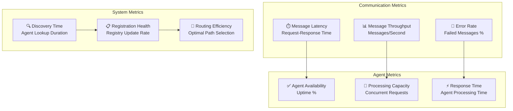

### Monitoring Implementation

```python
class A2APerformanceMonitor:
    """Monitor A2A protocol performance and health"""
    
    def __init__(self):
        self.metrics_collector = MetricsCollector()
        self.alert_manager = AlertManager()
        self.dashboard = MonitoringDashboard()
        
    async def monitor_a2a_message(
        self, 
        message: Message, 
        response: A2AResponse,
        execution_time: float
    ) -> None:
        """Monitor individual A2A message performance"""
        
        metrics = {
            "message_id": message.message_id,
            "conversation_id": message.conversation_id,
            "source_agent": message.metadata.get("source_agent"),
            "target_agent": message.metadata.get("target_agent"),
            "operation": message.metadata.get("operation"),
            "execution_time": execution_time,
            "success": response.success,
            "error_code": response.error_code if not response.success else None,
            "payload_size": len(str(message)),
            "response_size": len(str(response)),
            "timestamp": datetime.now()
        }
        
        # Record metrics
        await self.metrics_collector.record_message_metrics(metrics)
        
        # Check for anomalies
        if execution_time > 10.0:  # Slow response
            await self.alert_manager.send_alert(
                "SLOW_A2A_RESPONSE", 
                f"A2A message took {execution_time:.2f}s",
                severity="warning",
                context=metrics
            )
            
        if not response.success:  # Error response
            await self.alert_manager.send_alert(
                "A2A_MESSAGE_FAILED",
                f"A2A message failed: {response.error_message}",
                severity="error", 
                context=metrics
            )
    
    async def monitor_agent_health(self, agent_id: str) -> Dict[str, Any]:
        """Monitor individual agent health via A2A"""
        
        health_metrics = {
            "agent_id": agent_id,
            "timestamp": datetime.now(),
            "available": False,
            "response_time": None,
            "error_rate": 0.0,
            "capacity_usage": 0.0
        }
        
        try:
            # Send health check via A2A
            start_time = time.time()
            health_response = await self.send_health_check(agent_id)
            response_time = time.time() - start_time
            
            health_metrics.update({
                "available": True,
                "response_time": response_time,
                "agent_status": health_response.get("status", "unknown"),
                "version": health_response.get("version"),
                "capabilities": health_response.get("capabilities", []),
                "current_load": health_response.get("current_load", 0),
                "max_capacity": health_response.get("max_capacity", 100)
            })
            
            # Calculate derived metrics
            if health_metrics["max_capacity"] > 0:
                health_metrics["capacity_usage"] = (
                    health_metrics["current_load"] / health_metrics["max_capacity"]
                )
                
        except Exception as e:
            health_metrics["error"] = str(e)
            await self.alert_manager.send_alert(
                "AGENT_HEALTH_CHECK_FAILED",
                f"Health check failed for agent {agent_id}: {str(e)}",
                severity="critical"
            )
        
        await self.metrics_collector.record_agent_health(health_metrics)
        return health_metrics
        
    async def generate_performance_report(
        self, 
        time_range: str = "1h"
    ) -> Dict[str, Any]:
        """Generate A2A performance report"""
        
        report = await self.metrics_collector.query_metrics({
            "time_range": time_range,
            "metrics": [
                "message_count",
                "average_latency", 
                "error_rate",
                "agent_availability",
                "throughput"
            ]
        })
        
        return {
            "report_timestamp": datetime.now(),
            "time_range": time_range,
            "summary": {
                "total_messages": report.get("message_count", 0),
                "average_latency_ms": report.get("average_latency", 0) * 1000,
                "error_rate_percent": report.get("error_rate", 0) * 100,
                "system_availability": report.get("agent_availability", 0) * 100,
                "messages_per_second": report.get("throughput", 0)
            },
            "agent_breakdown": report.get("agent_metrics", {}),
            "top_errors": report.get("error_analysis", []),
            "performance_trends": report.get("trend_analysis", {}),
            "recommendations": self._generate_recommendations(report)
        }
        
    def _generate_recommendations(self, metrics: Dict[str, Any]) -> List[str]:
        """Generate performance improvement recommendations"""
        recommendations = []
        
        if metrics.get("error_rate", 0) > 0.05:  # >5% error rate
            recommendations.append(
                "High error rate detected. Review agent error logs and consider scaling."
            )
            
        if metrics.get("average_latency", 0) > 5.0:  # >5s average latency
            recommendations.append(
                "High latency detected. Consider optimizing agent processing or scaling infrastructure."
            )
            
        agent_metrics = metrics.get("agent_metrics", {})
        for agent_id, agent_data in agent_metrics.items():
            if agent_data.get("capacity_usage", 0) > 0.8:  # >80% capacity
                recommendations.append(
                    f"Agent {agent_id} is running at high capacity. Consider horizontal scaling."
                )
                
        return recommendations
```

This comprehensive documentation provides detailed insights into the A2A protocol implementation, message flows, agent capabilities, error handling, and monitoring within the Sasya Chikitsa multi-agent system.
