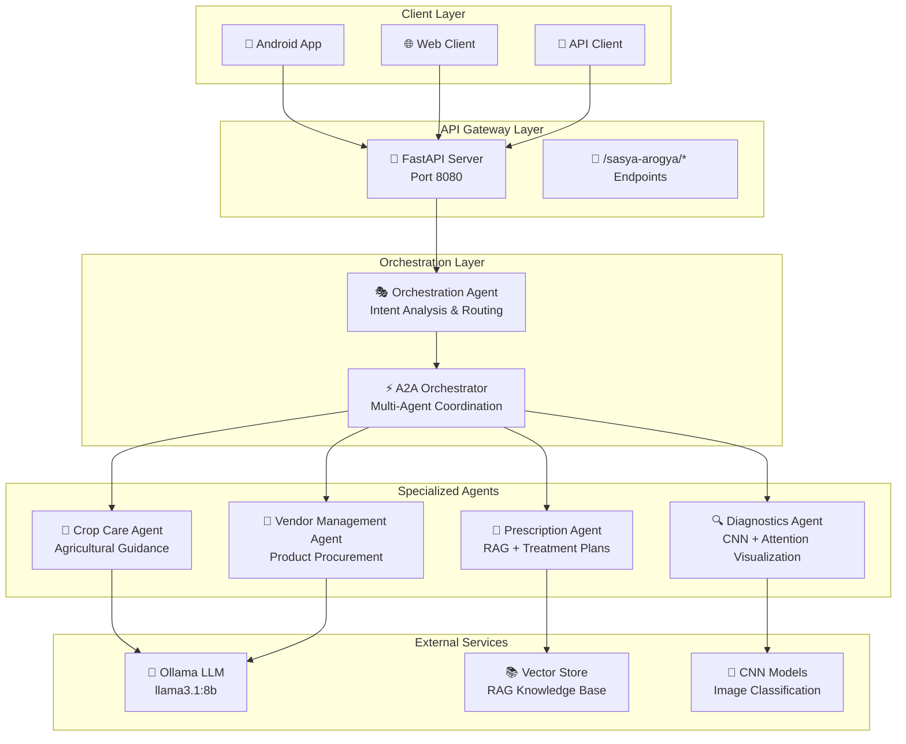
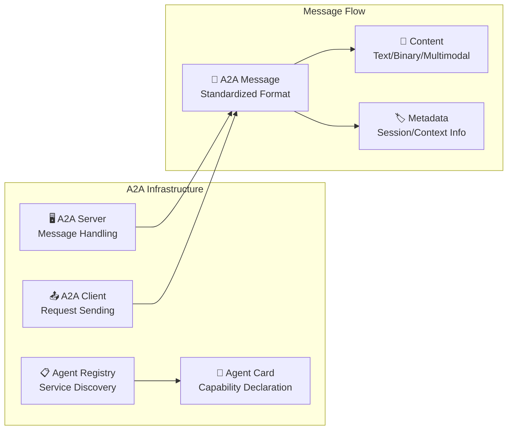
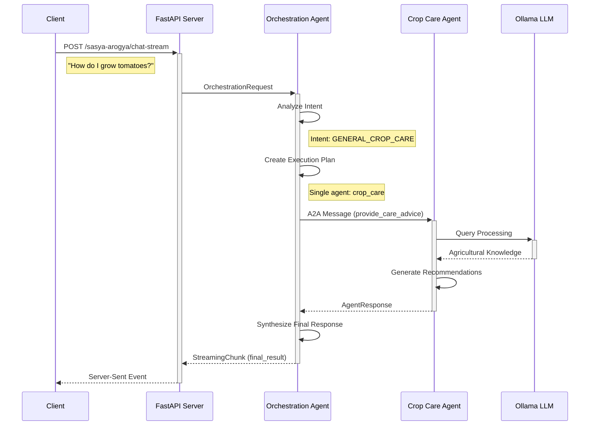
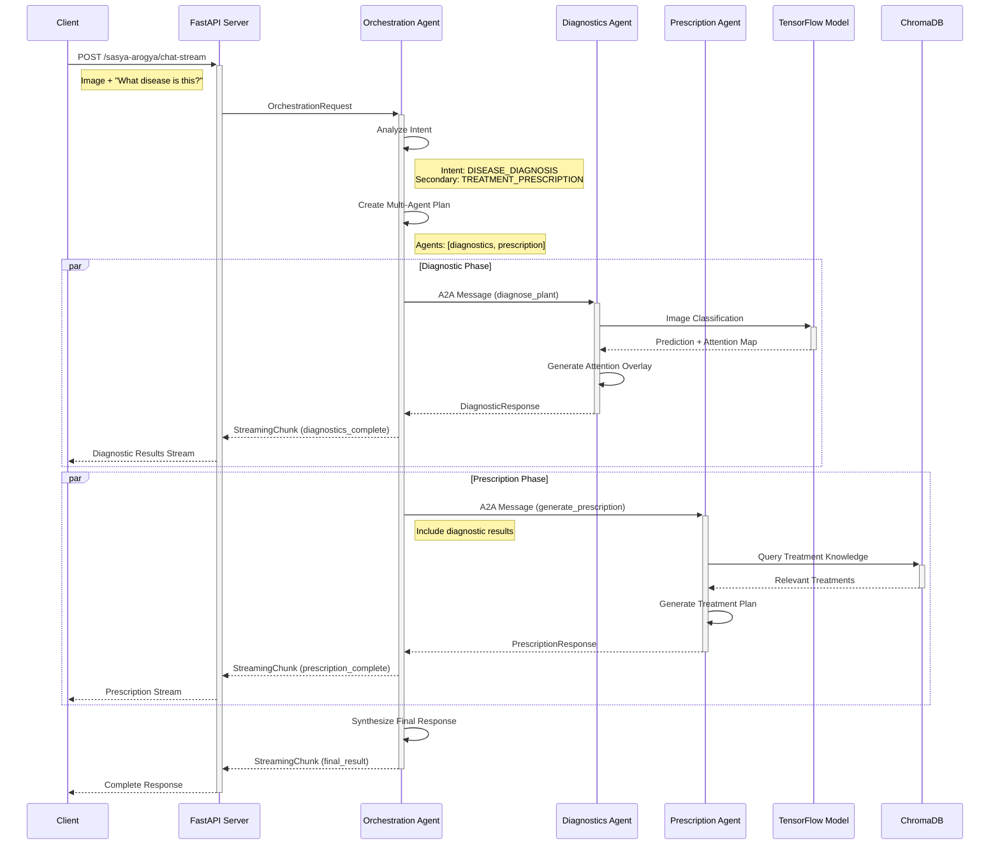
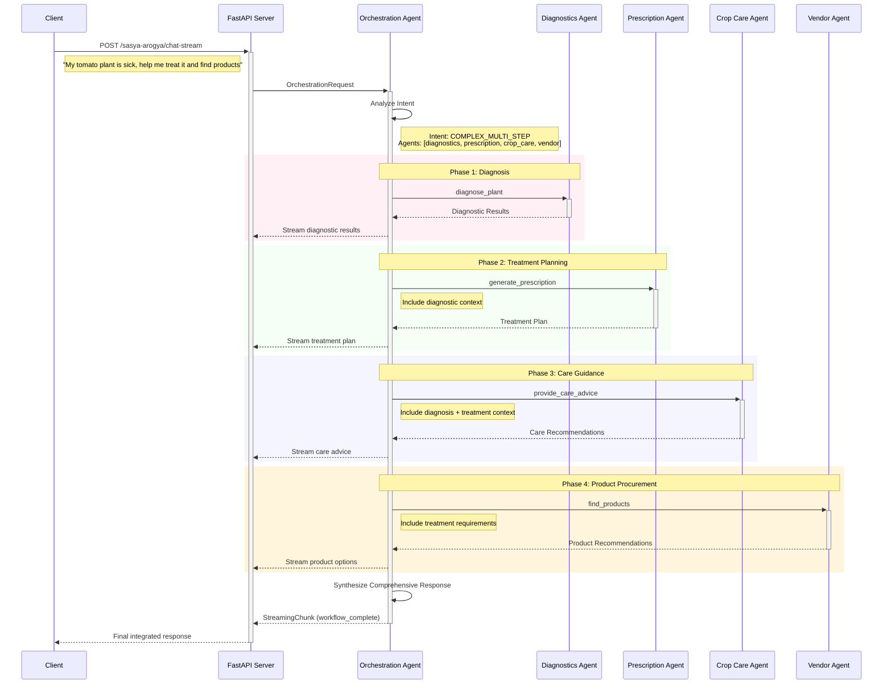
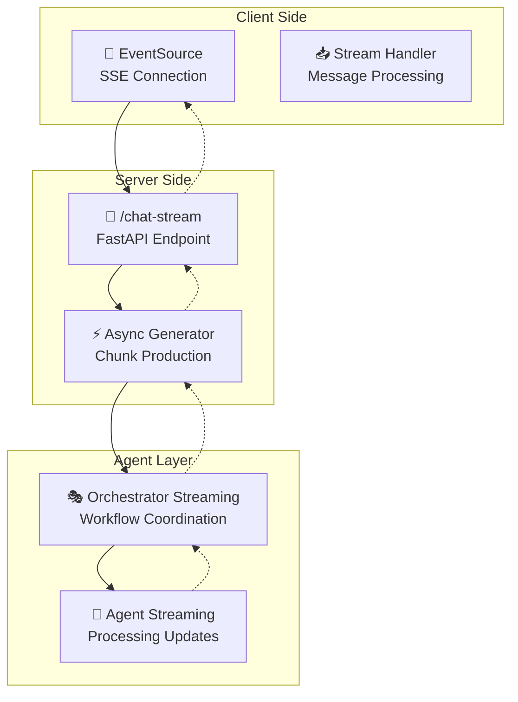
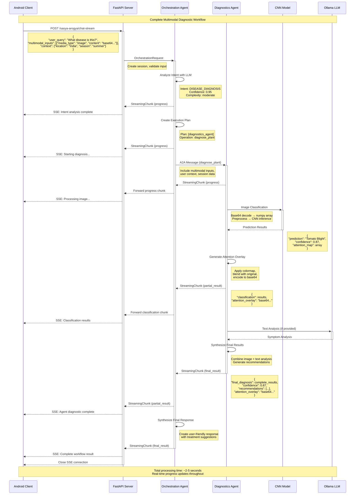
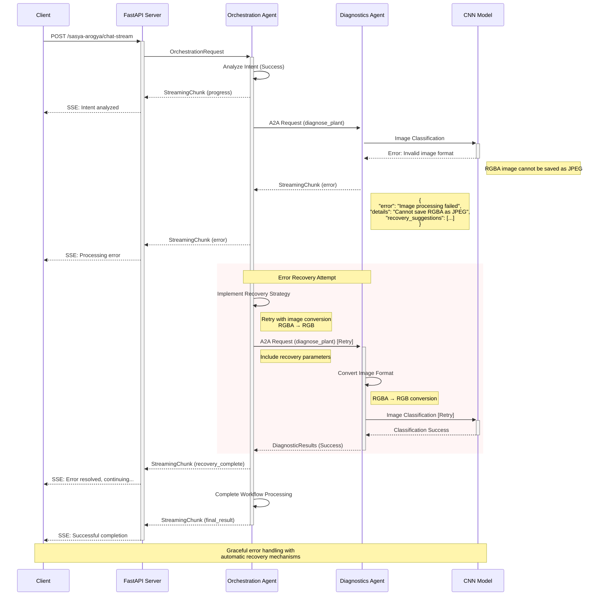
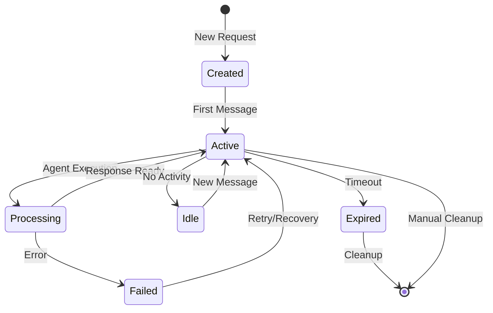

# Sasya Chikitsa Multi-Agent Architecture

## 📋 Table of Contents

1. [System Overview](#system-overview)
2. [Agent Architecture](#agent-architecture)
3. [A2A Protocol Integration](#a2a-protocol-integration)
4. [Request Flow Patterns](#request-flow-patterns)
5. [Streaming Architecture](#streaming-architecture)
6. [Sequence Diagrams](#sequence-diagrams)
7. [Data Models](#data-models)
8. [API Endpoints](#api-endpoints)
9. [Session Management](#session-management)
10. [Error Handling](#error-handling)

---

## 🏗️ System Overview

The Sasya Chikitsa Multi-Agent System is a comprehensive agricultural AI platform that uses specialized agents to provide plant care services. The system follows a distributed architecture pattern with Agent-to-Agent (A2A) protocol for inter-agent communication.

### Core Components



### Key Features

- **🎯 Intelligent Intent Resolution**: LLM-powered analysis of user queries
- **🔄 Multi-Agent Orchestration**: Coordinated execution across specialized agents
- **⚡ Real-time Streaming**: Server-sent events for live response updates
- **📡 A2A Protocol**: Standardized agent-to-agent communication
- **🧠 Multimodal Processing**: Support for text, image, video, and audio inputs
- **📊 Session Management**: Persistent conversation context
- **🔧 Fault Tolerance**: Graceful error handling and recovery

---

## 🤖 Agent Architecture

### Base Agent Pattern

All agents inherit from `AgentBase` and implement the following interface:

```python
class AgentBase(ABC):
    """Abstract base class for all agents"""
    
    def __init__(self, agent_id: str, agent_type: AgentType):
        self.agent_id = agent_id
        self.agent_type = agent_type
        self.a2a_server: Optional[A2AServer] = None
        self.a2a_client: Optional[A2AClient] = None
        
    @abstractmethod
    async def process_request(self, request: AgentRequest) -> AsyncGenerator[StreamingChunk, None]:
        """Process requests with streaming response"""
        
    @abstractmethod
    async def handle_request(self, task_data: Dict[str, Any], session_id: str) -> AgentResponse:
        """Handle direct requests (non-streaming)"""
        
    async def initialize_a2a(self) -> None:
        """Initialize A2A protocol components"""
        
    async def shutdown_a2a(self) -> None:
        """Cleanup A2A protocol components"""
```

### Specialized Agents

#### 1. 🔍 Multimodal Diagnostics Agent

**Purpose**: Plant disease diagnosis using CNN models and multimodal analysis

**Capabilities**:
- CNN-based image classification
- Attention visualization overlay generation
- Text symptom analysis
- Video frame analysis
- Confidence scoring and result synthesis

**Key Methods**:
```python
async def _execute_image_classification(self, image_input: MultimodalInput) -> Dict[str, Any]
async def _analyze_text_symptoms(self, text_input: str) -> Dict[str, Any]
async def _process_video_frames(self, video_input: MultimodalInput) -> Dict[str, Any]
```

**A2A Operations**:
- `diagnose_plant`: Primary diagnosis workflow
- `classify_image`: Image-only classification
- `analyze_text_symptoms`: Text symptom analysis
- `process_video`: Video analysis
- `synthesize_multimodal_results`: Result combination

#### 2. 💊 Prescription Agent

**Purpose**: Generate tailored treatment prescriptions using RAG knowledge

**Capabilities**:
- RAG-enhanced knowledge retrieval
- Context-aware prescription generation
- Treatment plan scheduling
- Dosage calculations
- Safety guidelines

**Key Methods**:
```python
async def _query_rag_knowledge(self, query: str, context: Dict) -> Dict[str, Any]
async def _generate_treatment_plan(self, diagnosis: Dict, context: Dict) -> Dict[str, Any]
async def _calculate_dosages(self, treatment: Dict, plant_info: Dict) -> Dict[str, Any]
```

**A2A Operations**:
- `generate_prescription`: Main prescription workflow
- `query_rag_knowledge`: Knowledge base queries
- `validate_treatment`: Treatment validation
- `schedule_applications`: Application scheduling

#### 3. 🌾 Crop Care Agent

**Purpose**: General agricultural guidance and best practices

**Capabilities**:
- Comprehensive agricultural knowledge
- Season-specific guidance
- Regional adaptation advice
- Practical recommendations
- Multi-domain expertise

**Key Methods**:
```python
async def _classify_user_query(self, query: str, context: Dict) -> Dict[str, Any]
async def _generate_practical_recommendations(self, classification: Dict) -> List[Dict]
async def _add_seasonal_considerations(self, recommendations: List, context: Dict) -> Dict
```

**A2A Operations**:
- `provide_care_advice`: Main guidance workflow
- `seasonal_recommendations`: Season-specific advice
- `analyze_growing_conditions`: Environmental analysis

#### 4. 🛒 Vendor Management Agent

**Purpose**: Product procurement and vendor management

**Capabilities**:
- Product search and discovery
- Multi-vendor price comparison
- Stock availability checking
- Order placement assistance
- Delivery coordination

**Key Methods**:
```python
async def _search_products(self, criteria: Dict) -> List[Dict]
async def _compare_prices(self, products: List[Dict]) -> Dict[str, Any]
async def _check_availability(self, product_id: str, location: str) -> Dict[str, Any]
```

**A2A Operations**:
- `find_products`: Product search
- `compare_prices`: Price comparison
- `check_stock_availability`: Stock verification
- `place_order`: Order management

#### 5. 🎭 Orchestration Agent

**Purpose**: Coordinate multi-agent workflows and intent resolution

**Capabilities**:
- LLM-driven intent analysis
- Multi-agent workflow planning
- Response synthesis
- Session management
- Error handling and recovery

**Key Methods**:
```python
async def _analyze_intent(self, user_query: str, context: Dict) -> IntentAnalysis
async def _create_execution_plan(self, intent: IntentType, context: Dict) -> List[AgentTask]
async def _synthesize_final_response(self, agent_responses: Dict) -> str
```

---

## 📡 A2A Protocol Integration

### Overview

The system uses the [python-a2a](https://python-a2a.readthedocs.io/) library to implement Google's Agent-to-Agent protocol for standardized inter-agent communication.

### A2A Components



### Agent Registration

Each agent registers its capabilities with the A2A registry:

```python
agent_card = AgentCard(
    name="Multimodal Diagnostics Agent",
    description="Advanced plant disease diagnosis using CNN and multimodal analysis",
    url="http://localhost:8080/diagnostics",
    version="1.0.0",
    provider="sasya-chikitsa",
    capabilities=[
        "diagnose_plant",
        "classify_image", 
        "analyze_text_symptoms",
        "process_video",
        "synthesize_multimodal_results"
    ]
)
```

### Message Format

A2A messages follow a standardized format:

```python
message = Message(
    content=TextContent(text=json.dumps(task_data)),
    role=MessageRole.AGENT,
    conversation_id=session_id,
    metadata={
        "operation": "diagnose_plant",
        "agent_type": "diagnostics",
        "priority": 1,
        "timeout": 60
    }
)
```

---

## 🔄 Request Flow Patterns

### 1. Single-Agent Flow (Simple Query)

**Use Case**: Basic crop care question without image analysis



### 2. Multi-Agent Flow (Disease Diagnosis + Treatment)

**Use Case**: Image-based disease diagnosis with treatment recommendations



### 3. Complex Multi-Step Flow (End-to-End Plant Care)

**Use Case**: Comprehensive plant care including diagnosis, treatment, and product procurement



---

## ⚡ Streaming Architecture

### Overview

The system provides real-time streaming responses using Server-Sent Events (SSE) to deliver incremental results as agents process requests.

### Streaming Components



### StreamingChunk Format

```python
class StreamingChunk(BaseModel):
    chunk_id: str
    session_id: str
    agent_type: AgentType
    chunk_type: Literal["progress", "partial_result", "final_result", "error"]
    data: Dict[str, Any]
    timestamp: datetime
    is_final: bool = False
```

### Chunk Types

1. **Progress Chunks**: Workflow status updates
2. **Partial Result Chunks**: Intermediate agent results  
3. **Final Result Chunks**: Complete workflow results
4. **Error Chunks**: Error information and recovery

### Streaming Patterns

#### Agent Processing Stream
```python
async def process_request(self, request: AgentRequest) -> AsyncGenerator[StreamingChunk, None]:
    # Initial progress
    yield StreamingChunk(
        chunk_type="progress",
        data={"message": "Starting image classification..."}
    )
    
    # Intermediate results
    yield StreamingChunk(
        chunk_type="partial_result", 
        data={"classification": result, "confidence": 0.85}
    )
    
    # Final result
    yield StreamingChunk(
        chunk_type="final_result",
        data={"diagnosis": final_diagnosis},
        is_final=True
    )
```

#### Multi-Agent Orchestration Stream
```python
async def _process_orchestration_request(self) -> AsyncGenerator[StreamingChunk, None]:
    # Intent analysis
    yield StreamingChunk(
        chunk_type="progress",
        data={"message": "Analyzing user intent..."}
    )
    
    # Agent execution
    for agent_task in execution_plan:
        yield StreamingChunk(
            chunk_type="progress", 
            data={"message": f"Executing {agent_task.agent_type} agent..."}
        )
        
        # Stream agent results
        task_response = await self._execute_single_agent_a2a(agent_task, session_id)
        yield StreamingChunk(
            chunk_type="partial_result",
            data={
                "agent_id": agent_task.agent_id,
                "result": task_response
            }
        )
    
    # Final synthesis
    yield StreamingChunk(
        chunk_type="final_result",
        data={"final_response": synthesized_response},
        is_final=True
    )
```

---

## 📊 Sequence Diagrams

### Complete Multimodal Diagnostic Flow



### Multi-Agent Workflow with Result Passing

```mermaid
sequenceDiagram
    participant C as Client
    participant API as FastAPI Server  
    participant O as Orchestration Agent
    participant D as Diagnostics Agent
    participant P as Prescription Agent
    participant RAG as ChromaDB
    
    C->>+API: POST /sasya-arogya/chat-stream
    Note right of C: "Diagnose and treat this diseased tomato plant"
    
    API->>+O: OrchestrationRequest
    
    rect rgb(255, 240, 245)
        Note over O,D: Phase 1: Disease Diagnosis
        O->>+D: A2A Request (diagnose_plant)
        D->>D: CNN Classification
        D->>D: Attention Visualization
        D-->>-O: DiagnosticResults
        Note right of D: {<br/>  "disease": "Early Blight",<br/>  "confidence": 0.92,<br/>  "severity": "moderate",<br/>  "affected_area": "25%"<br/>}
        
        O-->>API: StreamingChunk (diagnostic_complete)
        API-->>C: SSE: Diagnostic results
    end
    
    rect rgb(245, 255, 245)  
        Note over O,P: Phase 2: Treatment Generation
        O->>+P: A2A Request (generate_prescription)
        Note right of O: Include diagnostic results:<br/>{<br/>  "diagnosis_results": {<br/>    "disease": "Early Blight",<br/>    "severity": "moderate"<br/>  }<br/>}
        
        P->>+RAG: Query Treatment Database
        Note right of P: Query: "Early Blight treatment<br/>moderate severity tomato"
        RAG-->>-P: Treatment Knowledge
        
        P->>P: Generate Treatment Plan
        Note right of P: Customize based on:<br/>- Disease type & severity<br/>- Plant type (tomato)<br/>- Environmental context
        
        P-->>-O: PrescriptionResults  
        Note right of P: {<br/>  "treatment_plan": {...},<br/>  "products": [...],<br/>  "schedule": {...},<br/>  "monitoring": {...}<br/>}
        
        O-->>API: StreamingChunk (prescription_complete)
        API-->>C: SSE: Treatment plan
    end
    
    O->>O: Synthesize Integrated Response
    Note right of O: Combine diagnosis + prescription<br/>Generate user-friendly summary
    
    O-->>-API: StreamingChunk (workflow_complete)
    API-->>-C: SSE: Complete integrated response
    
    Note over C,RAG: End-to-end workflow with context passing<br/>Each phase builds upon previous results
```



### Error Handling and Recovery Flow



---

## 📋 Data Models

### Core Request/Response Models

```python
# Base Models
class AgentRequest(BaseModel):
    session_id: str
    user_query: str
    context: Dict[str, Any] = Field(default_factory=dict)
    user_preferences: Dict[str, Any] = Field(default_factory=dict)
    multimodal_inputs: List[MultimodalInput] = Field(default_factory=list)
    intent_analysis: Optional[IntentAnalysis] = None
    metadata: Dict[str, Any] = Field(default_factory=dict)

class AgentResponse(BaseModel):
    success: bool
    session_id: str
    agent_type: AgentType
    response_data: Dict[str, Any]
    metadata: Dict[str, Any] = Field(default_factory=dict)
    error_message: Optional[str] = None
    timestamp: datetime = Field(default_factory=datetime.now)

# Specialized Request Models
class DiagnosticsRequest(AgentRequest):
    inputs: List[MultimodalInput]
    plant_type: str = ""
    symptoms_text: str = ""
    location: str = ""
    growth_stage: str = ""

class PrescriptionRequest(AgentRequest):
    plant_name: str
    health_condition: str
    diagnosed_diseases: List[str] = Field(default_factory=list)
    location: str = ""
    season: str = ""
    growth_stage: str = ""
    severity: str = "medium"

class CropCareRequest(AgentRequest):
    query: str
    plant_type: str = ""
    location: str = ""
    season: str = ""
    farming_method: str = ""

class VendorRequest(AgentRequest):
    request_type: str = "search"  # search, compare, order
    products: List[str] = Field(default_factory=list)
    location: str = ""
    budget_range: Optional[Dict[str, float]] = None
    urgency: str = "medium"
    order_details: Optional[Dict[str, Any]] = None
```

### Task Management Models

```python
class AgentTask(BaseModel):
    task_id: str
    session_id: str
    agent_type: AgentType
    agent_id: str
    operation: str
    priority: int = 1
    dependencies: List[str] = Field(default_factory=list)
    request_data: Dict[str, Any]
    response_data: Optional[Dict[str, Any]] = None
    status: TaskStatus = TaskStatus.PENDING
    error_message: Optional[str] = None
    created_at: datetime = Field(default_factory=datetime.now)
    started_at: Optional[datetime] = None
    completed_at: Optional[datetime] = None

class IntentAnalysis(BaseModel):
    primary_intent: IntentType
    secondary_intents: List[IntentType] = Field(default_factory=list)
    confidence_score: float
    complexity_level: str
    requires_multiple_agents: bool
    extracted_entities: Dict[str, Any] = Field(default_factory=dict)
    reasoning: Optional[str] = None
```

### Streaming Models

```python
class StreamingChunk(BaseModel):
    chunk_id: str
    session_id: str
    agent_type: AgentType
    chunk_type: Literal["progress", "partial_result", "final_result", "error"]
    data: Dict[str, Any]
    timestamp: datetime = Field(default_factory=datetime.now)
    is_final: bool = False
    
    class Config:
        json_encoders = {
            datetime: lambda dt: dt.isoformat()
        }
```

---

## 🌐 API Endpoints

### Health and Status Endpoints

| Endpoint | Method | Description |
|----------|---------|-------------|
| `/sasya-arogya/health` | GET | System health check |
| `/sasya-arogya/agents` | GET | List all agents and capabilities |
| `/sasya-arogya/sessions` | GET | List active sessions |
| `/sasya-arogya/sessions/{session_id}` | GET | Get session status |
| `/sasya-arogya/sessions/{session_id}` | DELETE | Cleanup session |

### Chat Endpoints

| Endpoint | Method | Description |
|----------|---------|-------------|
| `/sasya-arogya/chat` | POST | Synchronous chat |
| `/sasya-arogya/chat-stream` | POST | Streaming chat with SSE |

### Direct Agent Endpoints

| Endpoint | Method | Description |
|----------|---------|-------------|
| `/sasya-arogya/agents/{agent_type}/direct` | POST | Direct agent access |

### Request/Response Examples

#### Streaming Chat Request
```json
{
  "user_query": "What disease does this tomato plant have?",
  "multimodal_inputs": [
    {
      "media_type": "image",
      "content": "data:image/jpeg;base64,/9j/4AAQSkZJRg...",
      "filename": "tomato_plant.jpg",
      "mime_type": "image/jpeg"
    }
  ],
  "context": {
    "location": "Maharashtra, India",
    "season": "monsoon",
    "plant_type": "tomato",
    "growth_stage": "flowering"
  },
  "session_id": "session_123"
}
```

#### Streaming Response (SSE)
```
data: {"chunk_id": "chunk_1", "chunk_type": "progress", "data": {"message": "Analyzing intent..."}}

data: {"chunk_id": "chunk_2", "chunk_type": "progress", "data": {"message": "Starting image classification..."}}

data: {"chunk_id": "chunk_3", "chunk_type": "partial_result", "data": {"agent_id": "diagnostics_agent", "result": {"classification": "Early Blight", "confidence": 0.87}}}

data: {"chunk_id": "chunk_4", "chunk_type": "final_result", "data": {"diagnosis": "Early Blight detected", "treatment_suggestions": [...]}, "is_final": true}
```

---

## 🔐 Session Management

### Session Lifecycle



### Session Storage

```python
class SessionManager:
    def __init__(self):
        self.active_sessions: Dict[str, Dict[str, Any]] = {}
        self.session_timeout = 3600  # 1 hour
        
    async def create_session(self, session_id: str) -> Dict[str, Any]:
        session = {
            "session_id": session_id,
            "created_at": datetime.now(),
            "last_activity": datetime.now(),
            "message_history": [],
            "agent_responses": {},
            "context": {},
            "status": "active"
        }
        self.active_sessions[session_id] = session
        return session
        
    async def update_session(self, session_id: str, data: Dict[str, Any]) -> None:
        if session_id in self.active_sessions:
            self.active_sessions[session_id].update(data)
            self.active_sessions[session_id]["last_activity"] = datetime.now()
            
    async def cleanup_expired_sessions(self) -> None:
        now = datetime.now()
        expired = [
            sid for sid, session in self.active_sessions.items()
            if (now - session["last_activity"]).seconds > self.session_timeout
        ]
        for sid in expired:
            del self.active_sessions[sid]
```

---

## ⚠️ Error Handling

### Error Categories

1. **Input Validation Errors**: Invalid request format, missing required fields
2. **Agent Processing Errors**: CNN model failures, LLM timeouts, database issues
3. **A2A Communication Errors**: Network failures, agent unavailability  
4. **System Resource Errors**: Memory issues, disk space, CPU limits
5. **External Service Errors**: Ollama downtime, ChromaDB connection issues

### Error Recovery Strategies

```python
class ErrorRecoveryManager:
    async def handle_agent_error(self, error: Exception, context: Dict) -> Dict[str, Any]:
        if isinstance(error, ImageProcessingError):
            return await self._recover_image_processing(error, context)
        elif isinstance(error, LLMTimeoutError):
            return await self._recover_llm_timeout(error, context)
        elif isinstance(error, A2ACommunicationError):
            return await self._recover_a2a_communication(error, context)
        else:
            return await self._fallback_recovery(error, context)
    
    async def _recover_image_processing(self, error: Exception, context: Dict) -> Dict[str, Any]:
        # Image format conversion, resize, quality adjustment
        # Retry with modified image parameters
        pass
        
    async def _recover_llm_timeout(self, error: Exception, context: Dict) -> Dict[str, Any]:
        # Retry with shorter prompt, use cached response, fallback model
        pass
        
    async def _recover_a2a_communication(self, error: Exception, context: Dict) -> Dict[str, Any]:
        # Retry with exponential backoff, use alternative agent, graceful degradation
        pass
```

### Circuit Breaker Pattern

```python
class CircuitBreaker:
    def __init__(self, failure_threshold: int = 5, recovery_timeout: int = 60):
        self.failure_threshold = failure_threshold
        self.recovery_timeout = recovery_timeout
        self.failure_count = 0
        self.last_failure_time = None
        self.state = "CLOSED"  # CLOSED, OPEN, HALF_OPEN
        
    async def call(self, func, *args, **kwargs):
        if self.state == "OPEN":
            if self._should_attempt_reset():
                self.state = "HALF_OPEN"
            else:
                raise CircuitBreakerOpenError("Circuit breaker is OPEN")
        
        try:
            result = await func(*args, **kwargs)
            self._on_success()
            return result
        except Exception as e:
            self._on_failure()
            raise e
```

---

## 🚀 Performance Considerations

### Scaling Strategy

- **Horizontal Scaling**: Multiple agent instances behind load balancers
- **Vertical Scaling**: Increased compute resources for CNN processing
- **Caching**: Redis for frequent queries, model result caching
- **Connection Pooling**: Database and HTTP connection optimization

### Monitoring Metrics

- **Request Latency**: End-to-end response times
- **Agent Processing Time**: Individual agent execution duration  
- **Memory Usage**: CNN model memory consumption
- **Error Rates**: Failed requests by error type
- **Throughput**: Requests per second by endpoint
- **Queue Depth**: Pending agent tasks

### Optimization Techniques

- **Model Quantization**: Reduced CNN model size
- **Batch Processing**: Multiple image classification requests
- **Async Processing**: Non-blocking I/O operations
- **Resource Pools**: CNN model instance pooling
- **Result Streaming**: Incremental response delivery

---

## 🔮 Future Enhancements

### Planned Features

1. **Multi-Language Support**: Regional language processing
2. **Advanced Analytics**: Farming trend analysis
3. **Mobile Push Notifications**: Real-time alert system
4. **Offline Capability**: Local model inference
5. **Blockchain Integration**: Supply chain tracking
6. **IoT Integration**: Sensor data processing
7. **Advanced Visualization**: AR plant overlay
8. **Expert System**: Human expert consultation

### Architecture Evolution

- **Microservices Migration**: Individual agent containerization
- **Event-Driven Architecture**: Kafka/RabbitMQ integration
- **Multi-Cloud Deployment**: AWS/GCP/Azure distribution
- **Edge Computing**: Local processing capabilities
- **GraphQL API**: Flexible query interface
- **WebRTC Integration**: Real-time video analysis

---

This comprehensive architecture documentation provides a detailed overview of the Sasya Chikitsa Multi-Agent System, covering all aspects from high-level system design to implementation details and future roadmap.
