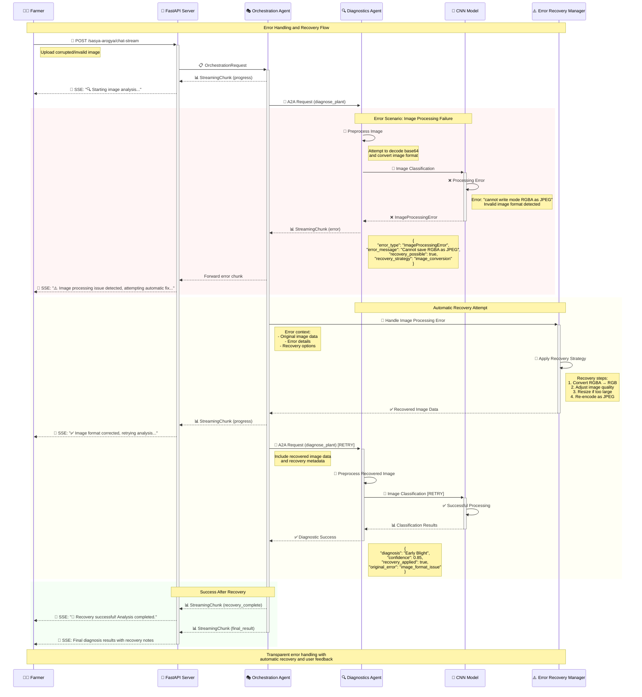
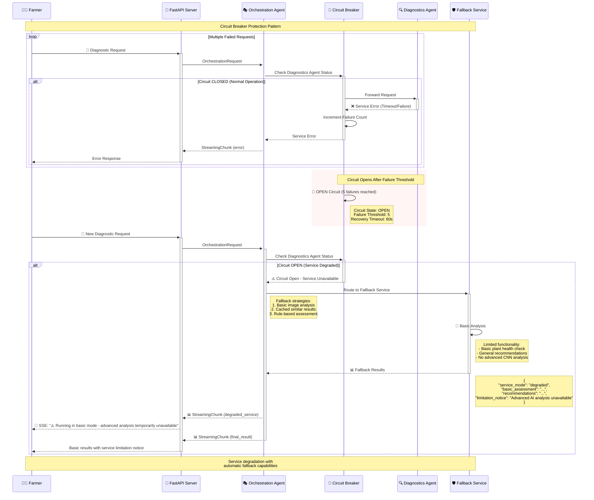
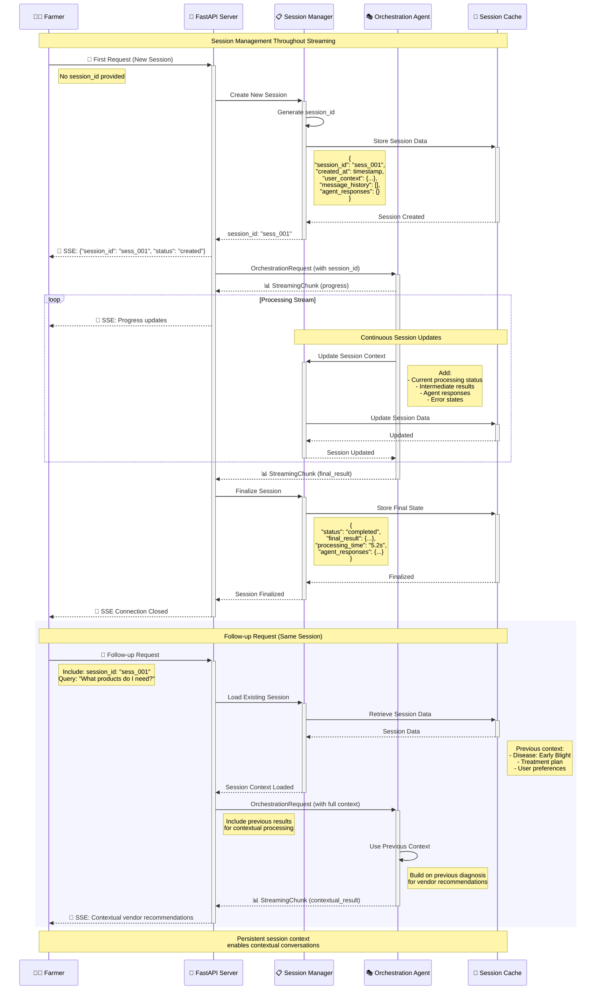
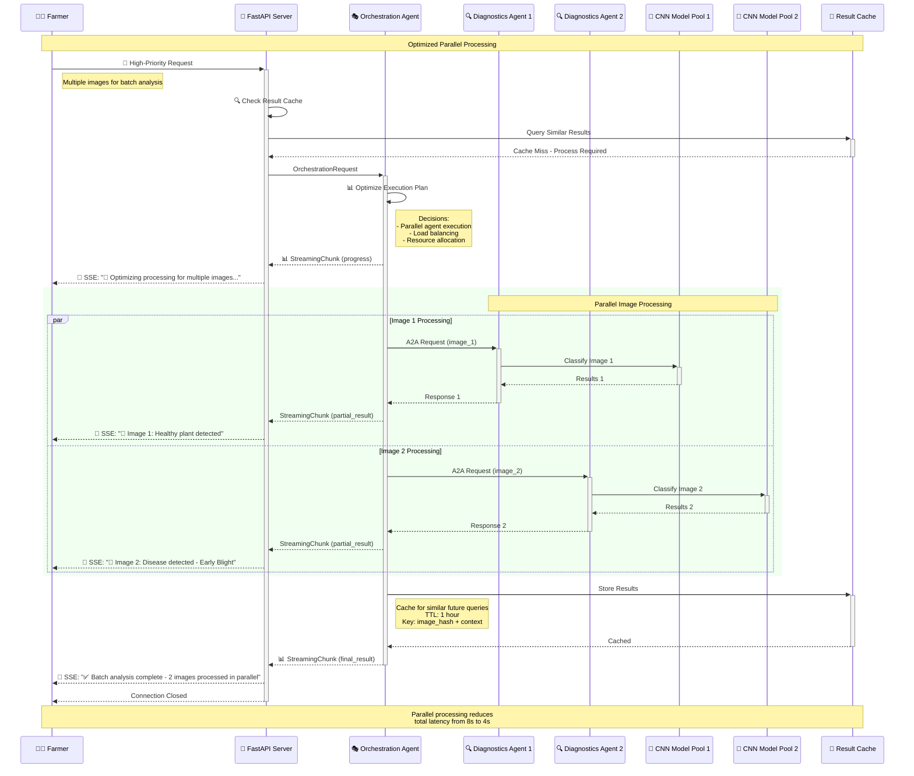
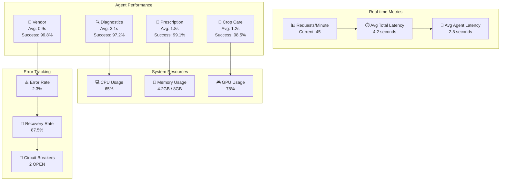

# Sasya Chikitsa Multi-Agent Streaming Architecture

## 📋 Table of Contents

1. [Streaming Overview](#streaming-overview)
2. [Real-time Diagnostic Flow](#real-time-diagnostic-flow)
3. [Multi-Agent Coordination](#multi-agent-coordination)
4. [Error Recovery Patterns](#error-recovery-patterns)
5. [Session Management](#session-management)
6. [Performance Optimization](#performance-optimization)

---

## 🌊 Streaming Overview

The Sasya Chikitsa platform provides real-time streaming responses using Server-Sent Events (SSE) to deliver immediate feedback as AI agents process agricultural requests. This ensures users see progress updates, intermediate results, and final responses as they become available.

### Key Benefits

- **Immediate Feedback**: Users see processing progress in real-time
- **Incremental Results**: Display partial results while processing continues
- **Better UX**: Avoid long loading times with progress indicators
- **Error Transparency**: Real-time error reporting and recovery updates
- **Resource Efficiency**: Stream results without buffering complete responses

---

## 🔍 Real-time Diagnostic Flow

### Complete Image Analysis Streaming

This diagram shows the complete flow when a farmer uploads a plant image for disease diagnosis, including CNN processing, attention visualization, and result streaming.

```mermaid
sequenceDiagram
    participant F as 👨‍🌾 Farmer (Android App)
    participant API as 🚀 FastAPI Server
    participant O as 🎭 Orchestration Agent
    participant D as 🔍 Diagnostics Agent
    participant CNN as 🧠 CNN Model (TensorFlow)
    participant ATT as 👁️ Attention Generator
    participant LLM as 🤖 Ollama LLM
    
    Note over F,LLM: Real-time Plant Disease Diagnosis with Streaming
    
    F->>+API: 📸 POST /sasya-arogya/chat-stream
    Note right of F: Payload:<br/>- Plant image (base64)<br/>- "What disease is this?"<br/>- Context: location, season, plant_type
    
    API->>API: 🔐 Validate Request & Create Session
    API-->>F: 📡 SSE Connection Established
    Note left of API: Stream: connection opened
    
    API->>+O: 📋 OrchestrationRequest
    Note right of API: session_id: "diag_session_001"<br/>multimodal_inputs: [image_data]
    
    rect rgb(255, 248, 220)
        Note over O,LLM: Phase 1: Intent Analysis (0.5-1s)
        O->>+LLM: 🧠 Analyze user intent
        Note right of O: Query: "What disease is this?"<br/>+ image presence detection
        
        O-->>API: 📊 StreamingChunk (progress)
        API-->>F: 📡 SSE: {"type": "progress", "message": "🔍 Analyzing your request..."}
        
        LLM-->>-O: 📋 Intent Analysis Result
        Note right of LLM: {<br/>  "primary_intent": "disease_diagnosis",<br/>  "confidence": 0.95,<br/>  "requires_image_analysis": true<br/>}
        
        O-->>API: 📊 StreamingChunk (progress)
        API-->>F: 📡 SSE: {"type": "progress", "message": "🎯 Intent: Disease Diagnosis (95% confidence)"}
    end
    
    rect rgb(240, 248, 255)
        Note over O,D: Phase 2: Execution Planning (0.2s)
        O->>O: 📝 Create Agent Execution Plan
        Note right of O: Selected agents: [diagnostics]<br/>Operation: diagnose_plant<br/>Priority: high
        
        O-->>API: 📊 StreamingChunk (progress)
        API-->>F: 📡 SSE: {"type": "progress", "message": "🔧 Planning diagnosis workflow..."}
        
        O->>+D: 📨 A2A Message (diagnose_plant)
        Note right of O: Include:<br/>- Multimodal inputs<br/>- User context<br/>- Session metadata
    end
    
    rect rgb(248, 255, 248)
        Note over D,ATT: Phase 3: Image Processing (2-4s)
        D-->>O: 📊 StreamingChunk (progress)
        O-->>API: Forward progress chunk
        API-->>F: 📡 SSE: {"type": "progress", "message": "🖼️ Processing plant image..."}
        
        D->>D: 🔧 Preprocess Image
        Note right of D: - Base64 decode<br/>- Resize to 224x224<br/>- Normalize pixel values<br/>- Convert to tensor
        
        D-->>O: 📊 StreamingChunk (progress)
        O-->>API: Forward progress chunk
        API-->>F: 📡 SSE: {"type": "progress", "message": "🔍 Running AI disease detection..."}
        
        D->>+CNN: 🧠 Image Classification
        Note right of D: Input: preprocessed image tensor<br/>Model: disease_classifier_v2.keras
        
        CNN->>CNN: 🔄 Forward Pass (Convolution layers)
        CNN->>CNN: 🔄 Feature Extraction (1024 features)
        CNN->>CNN: 🔄 Classification (15 disease classes)
        
        CNN-->>-D: 📊 Classification Results
        Note right of CNN: {<br/>  "prediction": "Tomato_Early_Blight",<br/>  "confidence": 0.87,<br/>  "class_probabilities": {...},<br/>  "feature_maps": attention_data<br/>}
        
        D-->>O: 📊 StreamingChunk (partial_result)
        O-->>API: Forward classification chunk
        API-->>F: 📡 SSE: {"type": "partial_result", "data": {"disease": "Early Blight", "confidence": "87%"}}
    end
    
    rect rgb(255, 240, 255)
        Note over D,ATT: Phase 4: Attention Visualization (1-2s)
        D->>+ATT: 👁️ Generate Attention Overlay
        Note right of D: Input:<br/>- Original image<br/>- Attention maps from CNN<br/>- Visualization config
        
        ATT->>ATT: 🎨 Apply Attention Heatmap
        Note right of ATT: - Extract attention weights<br/>- Apply blue/yellow colormap<br/>- Overlay on original image<br/>- 75% opacity blend
        
        ATT-->>-D: 🖼️ Attention Overlay (base64)
        
        D-->>O: 📊 StreamingChunk (partial_result)
        O-->>API: Forward attention chunk  
        API-->>F: 📡 SSE: {"type": "partial_result", "data": {"attention_overlay": "base64...", "focus_areas": "Leaf edges and spots"}}
    end
    
    rect rgb(255, 255, 240)
        Note over D,LLM: Phase 5: Result Synthesis (1s)
        D->>+LLM: 🤖 Generate Detailed Analysis
        Note right of D: Prompt:<br/>- Disease: Early Blight<br/>- Confidence: 87%<br/>- Plant type: Tomato<br/>- Season context<br/>- Location context
        
        LLM-->>-D: 📝 Detailed Diagnosis
        Note right of LLM: {<br/>  "disease_description": "...",<br/>  "symptoms_identified": [...],<br/>  "severity_assessment": "moderate",<br/>  "immediate_actions": [...],<br/>  "prevention_tips": [...]<br/>}
        
        D->>D: 🔧 Compile Final Results
        Note right of D: Combine:<br/>- CNN classification<br/>- Attention visualization<br/>- LLM analysis<br/>- Confidence scores
        
        D-->>-O: 📊 StreamingChunk (final_result)
        Note right of D: {<br/>  "diagnosis": "Early Blight",<br/>  "confidence": 0.87,<br/>  "severity": "moderate",<br/>  "attention_overlay": "base64...",<br/>  "recommendations": [...],<br/>  "immediate_actions": [...]<br/>}
    end
    
    rect rgb(240, 255, 240)
        Note over O,LLM: Phase 6: Response Synthesis (0.5s)
        O->>O: 🔧 Process Agent Results
        Note right of O: Extract key information<br/>Format for user display<br/>Add contextual advice
        
        O->>+LLM: 🤖 Synthesize User-Friendly Response
        Note right of O: Create farmer-friendly explanation<br/>Include action items<br/>Add local context
        
        LLM-->>-O: 📝 Final Response
        
        O-->>-API: 📊 StreamingChunk (final_result, is_final=true)
        API-->>F: 📡 SSE: Complete diagnosis with treatment recommendations
        
        API-->>F: 📡 SSE Connection Closed
    end
    
    Note over F,LLM: Total Processing Time: ~5-8 seconds<br/>User sees continuous progress updates<br/>Attention overlay displayed in expandable view
```



### Streaming Data Flow Breakdown

#### 1. Connection Establishment
```javascript
// Android Client - SSE Connection
const eventSource = new EventSource('/sasya-arogya/chat-stream', {
    method: 'POST',
    headers: { 'Content-Type': 'application/json' },
    body: JSON.stringify(diagnosticRequest)
});

eventSource.onmessage = (event) => {
    const chunk = JSON.parse(event.data);
    handleStreamingChunk(chunk);
};
```

#### 2. Progress Updates
```json
// Streaming chunks received by client
{"chunk_type": "progress", "data": {"message": "🔍 Analyzing your request...", "progress": 10}}
{"chunk_type": "progress", "data": {"message": "🎯 Intent: Disease Diagnosis", "progress": 20}}
{"chunk_type": "progress", "data": {"message": "🖼️ Processing plant image...", "progress": 40}}
{"chunk_type": "partial_result", "data": {"disease": "Early Blight", "confidence": 0.87, "progress": 70}}
{"chunk_type": "partial_result", "data": {"attention_overlay": "base64...", "progress": 85}}
{"chunk_type": "final_result", "data": {"complete_diagnosis": "...", "progress": 100}, "is_final": true}
```

#### 3. Real-time UI Updates
```kotlin
// Android - Handle streaming updates
fun handleStreamingChunk(chunk: StreamingChunk) {
    when (chunk.chunkType) {
        "progress" -> updateProgressBar(chunk.data.progress)
        "partial_result" -> {
            if (chunk.data.disease != null) {
                displayDiseaseResult(chunk.data.disease, chunk.data.confidence)
            }
            if (chunk.data.attention_overlay != null) {
                showAttentionOverlay(chunk.data.attention_overlay)
            }
        }
        "final_result" -> {
            hideProgressBar()
            displayCompleteResults(chunk.data)
        }
    }
}
```

---

## 🤝 Multi-Agent Coordination

### Complex Agricultural Workflow with Result Passing

This sequence shows how multiple agents coordinate to provide comprehensive plant care, including diagnosis, treatment planning, and product recommendations.

```mermaid
sequenceDiagram
    participant F as 👨‍🌾 Farmer
    participant API as 🚀 FastAPI Server
    participant O as 🎭 Orchestration Agent
    participant D as 🔍 Diagnostics Agent
    participant P as 💊 Prescription Agent
    participant C as 🌾 Crop Care Agent
    participant V as 🛒 Vendor Agent
    participant RAG as 📚 ChromaDB (RAG)
    participant LLM as 🤖 Ollama LLM
    
    Note over F,LLM: End-to-End Plant Care Workflow (8-12 seconds)
    
    F->>+API: 📸 POST /sasya-arogya/chat-stream
    Note right of F: "My tomato plant looks sick,<br/>help me treat it and find products"
    
    API->>+O: 📋 OrchestrationRequest
    O->>O: 🧠 Analyze Complex Intent
    O-->>API: 📊 StreamingChunk (progress)
    API-->>F: 📡 SSE: "🎯 Complex workflow detected: diagnosis → treatment → procurement"
    
    O->>O: 📝 Create Multi-Agent Execution Plan
    Note right of O: Workflow stages:<br/>1. Diagnostics (image analysis)<br/>2. Prescription (treatment planning)<br/>3. Crop Care (general guidance)<br/>4. Vendor (product sourcing)
    
    O-->>API: 📊 StreamingChunk (progress)
    API-->>F: 📡 SSE: "🔧 Planning 4-stage agricultural workflow..."
    
    rect rgb(255, 245, 245)
        Note over D,LLM: Stage 1: Disease Diagnosis (3-4s)
        O->>+D: 📨 A2A Request (diagnose_plant)
        
        par CNN Processing
            D->>D: 🧠 Image Classification
            D-->>O: 📊 StreamingChunk (progress)
            O-->>API: Forward diagnostic progress
            API-->>F: 📡 SSE: "🔍 AI analyzing plant image..."
        and Attention Generation
            D->>D: 👁️ Generate Attention Map
            D-->>O: 📊 StreamingChunk (partial_result)
            O-->>API: Forward attention results
            API-->>F: 📡 SSE: "🎯 Disease detection: Early Blight (87% confidence)"
        end
        
        D-->>-O: 🩺 Final Diagnostic Results
        Note right of D: {<br/>  "disease": "Early Blight",<br/>  "confidence": 0.87,<br/>  "severity": "moderate",<br/>  "affected_area_percent": 25,<br/>  "symptoms": ["brown spots", "leaf yellowing"]<br/>}
        
        O-->>API: 📊 StreamingChunk (stage_complete)
        API-->>F: 📡 SSE: "✅ Stage 1 Complete: Disease identified as Early Blight"
    end
    
    rect rgb(245, 255, 245)
        Note over P,RAG: Stage 2: Treatment Planning (2-3s)
        O->>+P: 📨 A2A Request (generate_prescription)
        Note right of O: Include diagnostic results:<br/>{<br/>  "diagnosis_context": {<br/>    "disease": "Early Blight",<br/>    "severity": "moderate",<br/>    "plant_type": "tomato"<br/>  }<br/>}
        
        P-->>O: 📊 StreamingChunk (progress)
        O-->>API: Forward prescription progress
        API-->>F: 📡 SSE: "💊 Searching treatment database for Early Blight..."
        
        P->>+RAG: 🔍 Query Treatment Knowledge
        Note right of P: Query: "Early Blight moderate severity<br/>tomato treatment organic methods"
        
        RAG-->>-P: 📚 Treatment Information
        Note right of RAG: Retrieved documents:<br/>- Organic fungicides<br/>- Copper-based treatments<br/>- Prevention methods<br/>- Application schedules
        
        P->>+LLM: 🤖 Generate Treatment Plan
        Note right of P: Customize treatment based on:<br/>- Disease severity<br/>- Plant type & stage<br/>- Farmer's context<br/>- Available products
        
        LLM-->>-P: 📋 Customized Treatment Plan
        
        P-->>-O: 💊 Treatment Results
        Note right of P: {<br/>  "treatment_plan": {<br/>    "primary_treatment": "Copper oxychloride spray",<br/>    "application_schedule": "Every 7 days for 3 weeks",<br/>    "preventive_measures": [...],<br/>    "monitoring_guidelines": [...]<br/>  }<br/>}
        
        O-->>API: 📊 StreamingChunk (stage_complete)
        API-->>F: 📡 SSE: "✅ Stage 2 Complete: Treatment plan ready"
    end
    
    rect rgb(245, 245, 255)
        Note over C,LLM: Stage 3: Crop Care Guidance (1-2s)
        O->>+C: 📨 A2A Request (provide_care_advice)
        Note right of O: Include context:<br/>{<br/>  "diagnosis_results": {...},<br/>  "treatment_plan": {...},<br/>  "environmental_context": {...}<br/>}
        
        C-->>O: 📊 StreamingChunk (progress)
        O-->>API: Forward crop care progress
        API-->>F: 📡 SSE: "🌾 Generating comprehensive care guidance..."
        
        C->>+LLM: 🤖 Generate Agricultural Advice
        Note right of C: Include:<br/>- Disease management tips<br/>- Seasonal considerations<br/>- Soil health recommendations<br/>- Future prevention strategies
        
        LLM-->>-C: 🌱 Agricultural Guidance
        
        C-->>-O: 🌾 Care Recommendations
        Note right of C: {<br/>  "care_recommendations": {<br/>    "immediate_actions": [...],<br/>    "weekly_monitoring": [...],<br/>    "soil_management": [...],<br/>    "prevention_strategies": [...]<br/>  }<br/>}
        
        O-->>API: 📊 StreamingChunk (stage_complete)
        API-->>F: 📡 SSE: "✅ Stage 3 Complete: Care guidance prepared"
    end
    
    rect rgb(255, 245, 220)
        Note over V,LLM: Stage 4: Product Procurement (1-2s)
        O->>+V: 📨 A2A Request (find_products)
        Note right of O: Include requirements:<br/>{<br/>  "treatment_requirements": {<br/>    "primary_product": "Copper oxychloride",<br/>    "application_tools": ["sprayer"],<br/>    "protective_equipment": [...],<br/>    "quantity_needed": "500ml"<br/>  }<br/>}
        
        V-->>O: 📊 StreamingChunk (progress)
        O-->>API: Forward vendor progress
        API-->>F: 📡 SSE: "🛒 Finding products and suppliers in your area..."
        
        V->>V: 🔍 Search Product Database
        Note right of V: Search criteria:<br/>- Product: Copper oxychloride<br/>- Location: farmer's area<br/>- Budget considerations<br/>- Availability status
        
        V->>+LLM: 🤖 Generate Product Recommendations
        LLM-->>-V: 📦 Product Suggestions
        
        V-->>-O: 🛒 Product Results
        Note right of V: {<br/>  "product_recommendations": {<br/>    "primary_products": [...],<br/>    "suppliers": [...],<br/>    "estimated_costs": {...},<br/>    "availability": {...}<br/>  }<br/>}
        
        O-->>API: 📊 StreamingChunk (stage_complete)
        API-->>F: 📡 SSE: "✅ Stage 4 Complete: Products located"
    end
    
    rect rgb(240, 255, 240)
        Note over O,LLM: Final Synthesis: Integrated Response (1s)
        O->>O: 🔧 Compile Multi-Agent Results
        Note right of O: Combine results from:<br/>- Diagnostic findings<br/>- Treatment recommendations<br/>- Care guidance<br/>- Product suggestions
        
        O->>+LLM: 🤖 Create Comprehensive Summary
        Note right of O: Generate farmer-friendly<br/>integrated response with:<br/>- Action priority<br/>- Timeline<br/>- Cost estimates<br/>- Success metrics
        
        LLM-->>-O: 📋 Integrated Response
        
        O-->>-API: 📊 StreamingChunk (workflow_complete, is_final=true)
        API-->>F: 📡 SSE: Complete integrated plant care solution
        
        API-->>F: 📡 SSE Connection Closed
    end
    
    Note over F,LLM: 🎉 Complete Workflow: 8-12 seconds<br/>Real-time updates throughout each stage<br/>Comprehensive solution with actionable steps
```



### Result Passing Between Agents

#### Data Flow Context Passing
```python
# Orchestrator passes context between agents
async def _execute_multi_agent_workflow_a2a(self, tasks: List[AgentTask], session_id: str):
    agent_responses = {}
    
    for i, task in enumerate(tasks):
        # Inject previous agent results into current task
        if i > 0 and task.agent_type == AgentType.PRESCRIPTION:
            # Pass diagnostic results to prescription agent
            task.request_data["diagnosis_results"] = agent_responses.get("diagnostics", {})
            
        if i > 0 and task.agent_type == AgentType.CROP_CARE:
            # Pass both diagnostic and prescription results to crop care agent
            task.request_data["diagnosis_results"] = agent_responses.get("diagnostics", {})
            task.request_data["treatment_context"] = agent_responses.get("prescription", {})
            
        if i > 0 and task.agent_type == AgentType.VENDOR_MANAGEMENT:
            # Pass treatment requirements to vendor agent
            treatment_data = agent_responses.get("prescription", {})
            task.request_data["product_requirements"] = {
                "treatments": treatment_data.get("treatment_plan", {}),
                "quantities": treatment_data.get("quantities", {}),
                "urgency": "high" if agent_responses.get("diagnostics", {}).get("severity") == "severe" else "medium"
            }
        
        # Execute task and collect results
        task_response = await self._execute_single_agent_a2a(task, session_id)
        agent_responses.update(task_response)
        
        # Stream intermediate results
        yield StreamingChunk(
            chunk_type="partial_result",
            data={
                "stage": i+1,
                "agent_type": task.agent_type.value,
                "results": task_response,
                "context_passed": len(task.request_data.get("diagnosis_results", {})) > 0
            }
        )
```

---

## ⚠️ Error Recovery Patterns

### Graceful Error Handling with Recovery Streaming

This diagram shows how the system handles errors gracefully and attempts automatic recovery while keeping the user informed.



### Circuit Breaker Pattern for Agent Failures



### Error Recovery Strategies by Type

```python
class StreamingErrorHandler:
    """Handle different types of errors with appropriate recovery strategies"""
    
    async def handle_streaming_error(
        self, 
        error: Exception, 
        context: Dict[str, Any],
        stream_writer: Callable
    ) -> AsyncGenerator[StreamingChunk, None]:
        
        if isinstance(error, ImageProcessingError):
            yield StreamingChunk(
                chunk_type="error",
                data={
                    "error_type": "image_processing",
                    "message": "Image processing failed, attempting automatic fix...",
                    "recovery_in_progress": True
                }
            )
            
            async for recovery_chunk in self._recover_image_processing(error, context):
                yield recovery_chunk
                
        elif isinstance(error, LLMTimeoutError):
            yield StreamingChunk(
                chunk_type="error", 
                data={
                    "error_type": "llm_timeout",
                    "message": "AI processing taking longer than expected...",
                    "estimated_wait": "30 seconds"
                }
            )
            
            async for timeout_chunk in self._handle_llm_timeout(error, context):
                yield timeout_chunk
                
        elif isinstance(error, AgentUnavailableError):
            yield StreamingChunk(
                chunk_type="error",
                data={
                    "error_type": "agent_unavailable", 
                    "message": "Service temporarily unavailable, switching to backup...",
                    "fallback_activated": True
                }
            )
            
            async for fallback_chunk in self._activate_fallback_service(error, context):
                yield fallback_chunk
                
    async def _recover_image_processing(
        self, 
        error: ImageProcessingError, 
        context: Dict[str, Any]
    ) -> AsyncGenerator[StreamingChunk, None]:
        
        try:
            # Attempt image format conversion
            yield StreamingChunk(
                chunk_type="progress",
                data={"message": "Converting image format..."}
            )
            
            recovered_image = await self._convert_image_format(context["image_data"])
            
            yield StreamingChunk(
                chunk_type="progress", 
                data={"message": "Retrying analysis with corrected image..."}
            )
            
            # Retry with recovered image
            result = await self._retry_image_analysis(recovered_image)
            
            yield StreamingChunk(
                chunk_type="final_result",
                data={
                    "recovery_successful": True,
                    "result": result,
                    "recovery_method": "image_format_conversion"
                }
            )
            
        except Exception as recovery_error:
            yield StreamingChunk(
                chunk_type="error",
                data={
                    "recovery_failed": True,
                    "error": str(recovery_error),
                    "fallback_required": True
                }
            )
```

---

## 🔄 Session Management

### Session Lifecycle with Streaming Context



### Session State Management During Streaming

```python
class StreamingSessionManager:
    """Manage session state during streaming operations"""
    
    def __init__(self):
        self.active_streams: Dict[str, Dict[str, Any]] = {}
        self.session_cache = SessionCache()
        
    async def start_streaming_session(
        self, 
        session_id: str, 
        request: ChatRequest
    ) -> Dict[str, Any]:
        """Initialize streaming session"""
        
        stream_context = {
            "session_id": session_id,
            "started_at": datetime.now(),
            "request": request.dict(),
            "chunks_sent": 0,
            "current_stage": "initialization",
            "agent_states": {},
            "error_count": 0,
            "recovery_attempts": 0
        }
        
        self.active_streams[session_id] = stream_context
        
        # Load existing session context if available
        existing_session = await self.session_cache.get_session(session_id)
        if existing_session:
            stream_context["previous_context"] = existing_session
            
        return stream_context
        
    async def update_streaming_state(
        self, 
        session_id: str, 
        chunk: StreamingChunk
    ) -> None:
        """Update session state with streaming chunk"""
        
        if session_id not in self.active_streams:
            return
            
        stream_context = self.active_streams[session_id]
        stream_context["chunks_sent"] += 1
        stream_context["last_update"] = datetime.now()
        
        # Update stage tracking
        if chunk.chunk_type == "progress":
            stream_context["current_stage"] = chunk.data.get("stage", "processing")
        elif chunk.chunk_type == "partial_result":
            agent_type = chunk.agent_type.value
            stream_context["agent_states"][agent_type] = {
                "status": "completed",
                "result": chunk.data,
                "timestamp": chunk.timestamp
            }
        elif chunk.chunk_type == "error":
            stream_context["error_count"] += 1
            stream_context["last_error"] = {
                "error": chunk.data,
                "timestamp": chunk.timestamp
            }
            
        # Persist important updates
        if chunk.chunk_type in ["partial_result", "final_result", "error"]:
            await self.session_cache.update_session(session_id, {
                "streaming_state": stream_context,
                "last_chunk": chunk.dict()
            })
            
    async def finalize_streaming_session(
        self, 
        session_id: str, 
        final_result: Optional[Dict[str, Any]] = None
    ) -> None:
        """Clean up streaming session"""
        
        if session_id not in self.active_streams:
            return
            
        stream_context = self.active_streams[session_id]
        stream_context["completed_at"] = datetime.now()
        stream_context["duration"] = (
            stream_context["completed_at"] - stream_context["started_at"]
        ).total_seconds()
        
        # Store final session state
        session_summary = {
            "session_id": session_id,
            "total_chunks": stream_context["chunks_sent"],
            "processing_duration": stream_context["duration"],
            "agents_used": list(stream_context["agent_states"].keys()),
            "error_count": stream_context["error_count"],
            "final_result": final_result,
            "completed_successfully": final_result is not None
        }
        
        await self.session_cache.finalize_session(session_id, session_summary)
        
        # Clean up active stream
        del self.active_streams[session_id]
```

---

## 🚀 Performance Optimization

### Parallel Processing and Streaming Optimization



### Streaming Buffer Management

```python
class OptimizedStreamingManager:
    """Optimized streaming with buffer management and batching"""
    
    def __init__(self):
        self.chunk_buffer: Dict[str, List[StreamingChunk]] = {}
        self.batch_size = 5
        self.flush_interval = 0.5  # seconds
        self.compression_enabled = True
        
    async def stream_with_optimization(
        self, 
        session_id: str, 
        chunk_generator: AsyncGenerator[StreamingChunk, None]
    ) -> AsyncGenerator[str, None]:
        """Stream chunks with batching and compression optimization"""
        
        buffer = []
        last_flush = time.time()
        
        async for chunk in chunk_generator:
            buffer.append(chunk)
            
            # Flush conditions
            should_flush = (
                len(buffer) >= self.batch_size or
                chunk.chunk_type == "final_result" or
                chunk.chunk_type == "error" or
                (time.time() - last_flush) >= self.flush_interval
            )
            
            if should_flush:
                # Batch process chunks
                processed_chunks = await self._process_chunk_batch(buffer)
                
                for processed_chunk in processed_chunks:
                    # Apply compression if enabled
                    if self.compression_enabled and len(str(processed_chunk)) > 1024:
                        compressed_data = await self._compress_chunk(processed_chunk)
                        yield f"data: {compressed_data}\n\n"
                    else:
                        yield f"data: {processed_chunk.json()}\n\n"
                
                buffer = []
                last_flush = time.time()
                
    async def _process_chunk_batch(
        self, 
        chunks: List[StreamingChunk]
    ) -> List[StreamingChunk]:
        """Process a batch of chunks for optimization"""
        
        # Merge progress chunks
        progress_chunks = [c for c in chunks if c.chunk_type == "progress"]
        other_chunks = [c for c in chunks if c.chunk_type != "progress"]
        
        processed_chunks = []
        
        # Combine multiple progress updates into single chunk
        if len(progress_chunks) > 1:
            merged_progress = StreamingChunk(
                chunk_id=str(uuid.uuid4()),
                session_id=progress_chunks[0].session_id,
                agent_type=progress_chunks[-1].agent_type,
                chunk_type="progress",
                data={
                    "messages": [c.data.get("message", "") for c in progress_chunks],
                    "current_stage": progress_chunks[-1].data.get("stage", "processing"),
                    "progress": progress_chunks[-1].data.get("progress", 0)
                }
            )
            processed_chunks.append(merged_progress)
        elif len(progress_chunks) == 1:
            processed_chunks.extend(progress_chunks)
            
        # Add other chunks as-is
        processed_chunks.extend(other_chunks)
        
        return processed_chunks
        
    async def _compress_chunk(self, chunk: StreamingChunk) -> str:
        """Compress large chunks for efficient transmission"""
        import gzip
        import json
        
        chunk_json = chunk.json()
        compressed_data = gzip.compress(chunk_json.encode('utf-8'))
        
        return json.dumps({
            "compressed": True,
            "data": base64.b64encode(compressed_data).decode('utf-8'),
            "original_size": len(chunk_json),
            "compressed_size": len(compressed_data)
        })
```

### Performance Metrics Dashboard



This comprehensive streaming architecture documentation provides detailed insights into how the Sasya Chikitsa multi-agent system delivers real-time, responsive agricultural AI services through optimized streaming patterns, robust error handling, and efficient resource utilization.
